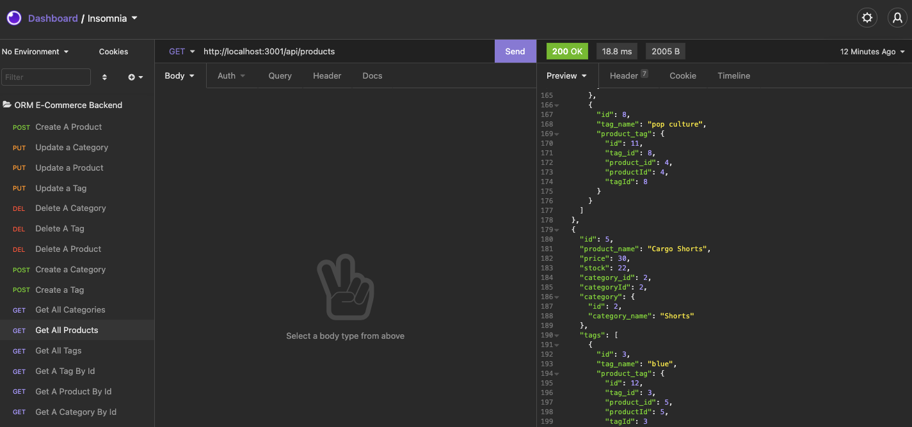

# E-Commerce Back End     

# Table of Contents
- [Project Description](#project-description)
- [Installation Instructions](#installation-instructions)
- [Usage](#usage)
- [Screenshot](#screenshot)
- [Walkthrough Videos](#walkthrough-video)  
- [How To Contribute](#how-to-contribute)
- [Technology](#technology)
- [Questions](#questions)
- [License](#license)

# Project Description
This small server application provides database persistence for Categories, Products
belonging to those Categories, and Tags which can be applied to multiple Products.  This information
is persisted in an SQL database and made available as a series of Express API routes to Create, Read, Update, and Delete (CRUD) those items.

The API will be demonstrated through the tool, Insomnia, demonstrating the API use and the data supplied and results returned.

# Installation Instructions

Pre-requisite: [MySQL](https://www.mysql.com) with an appropriate login to create a database and tables in that database.

1.  Install [node.js](http://nodejs.org)
2.  Edit the `.env` file with the database details    
3.  Using the installed Node Package Manager `npm`, execute `npm install` to install the required libraries.
4.  Execute `npm run seed` to seed the test data into the database

# Usage

Execute `npm run start` to start the Express API server.

# Screenshot

# Walkthrough Video

1.  Creation of the database, creating seed data, starting the API server  [walkthrough part 1](https://drive.google.com/file/d/1-oK6Xb5BSsQx2W11IBQ1Cy3Dvn80cxBB/view)
2.  Demonstration of the CRUD API [walkthrough part 2](https://drive.google.com/file/d/1m9UDnPNW076lJxg8-3GgiFK9iNss1f1f/view)

## How to contribute

Please access the [Questions](#questions) section to send me an email, or access the repository link if you wish to help contribute to this project.

# Technology

1. [Node.js](http://nodejs.org)
2. NPM
3. [MySQL](https://www.mysql.com/)
4. [MySQL2](https://www.npmjs.com/package/mysql2)
5. [DotENV](https://www.npmjs.com/package/dotenv)
6. [Git-Crypt](https://github.com/AGWA/git-crypt)
7. [Sequelize](https://sequelize.org)

# Questions

>  **Direct your questions about this project to:**
>
>  *GitHub:* [Github Project Link](https://github.com/jsharples777/week-14-homework)
>
>  *Email:* [jamie.sharples@gmail.com](mailto:jamie.sharples@gmail.com)

# License

### [MIT License](https://opensource.org/licenses/MIT)
A short and simple permissive license with conditions only requiring preservation of copyright and license notices. Licensed works, modifications, and larger works may be distributed under different terms and without source code.